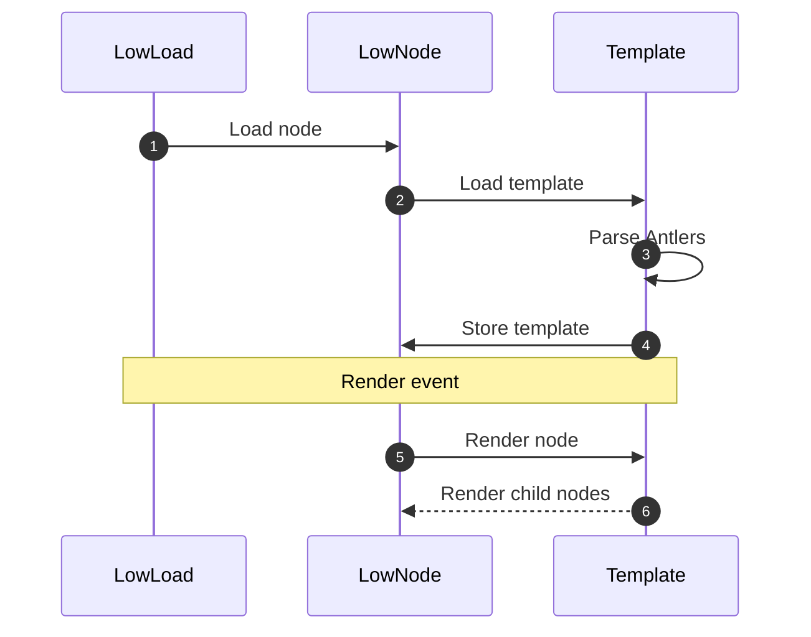

<a href="https://rubygems.org/gems/antlers" title="Install gem"></a>

# Antlers

`<{ Antlers }>` is a templating language designed to be embedded within HTML, where that HTML itself is embedded within a Ruby file.
This gives Antlers access to the class it's embedded in at runtime where it can perform additional logic.

Antlers is used by [LowNode](https://github.com/low-rb/low_node) to render child nodes in a compositional way.

## Syntax

### Variables

Access an instance variable with:
```ruby
def render
  <html>{@user}</html>
end
```

### Components

Render a class named `UserNode` with:
```ruby
def render
  <html><{ UserNode }></html>
end
```

ℹ️ The class referenced via `<{ MyClass }>` must implement a `def render(event:)` method.

**Props:**
```ruby
def render
  <html><{ UserNode user=@user }></html>
end
```

**Slots:**
```ruby
def render
  <html>
    <{ LayoutNode: }>
      Arbitrary example text.
    <{ :LayoutNode }>
  </html>
end
```

The `LayoutNode` would look like:
```ruby
class LayoutNode
  def render(event:, title:)
    <header>...</header>
    <{ :slot }>
    <footer>...</footer>
  end
end
```

### Conditionals [UNRELEASED]

```ruby
# Block.
<{ if: @user.happy? }>
  <{ UserNode user=@user }>
<{ :if }>

# Directive.
<{ UserNode user=@user if: @user.happy? }>
```

### Loops [UNRELEASED]

```ruby
# Block.
<{ for: user in: @users }>
  <{ UserNode user=user }>
<{ :for }>

# Directive.
<{ UserNode user=user for: user in: @users }>

# Directive with simplified prop.
<{ UserNode user for: user in: @users }>
```

## Config [UNRELEASED]

### Enabling parallelism

Add parallelism where it makes sense and you can measure the performance outcome and keep data integrity.

**Per sibling:**
```ruby
def render
  <{ parallelize: }>
    # For Loop executed at the same time as UserNode.
    <{ for: user in: @users }>
      <{ UserNode user=user }>
    <{ :for }>

    # PostsNode executed at the same time as For Loop.
    <{ PostsNode }>
  <{ :parallelize }>
end
```

ℹ️ The For loop in the example above still renders `PostsNode`s sequentially unless you use `map:` with a `:parallelize` directive.

**Per block:**
```ruby
# Each UserNode rendered at the same time.
<{ map: user in: @users :parallelize }>
  <{ UserNode user=user }>
<{ :map }>
```

**Per directive:**
```ruby
<{ UserNode user=user for: user in: @users :parallelize }>
```

## Advanced Techniques

### Strings

Variables (`{}`) are also useful for embedding text in RBX without any syntax highlighting issues:
```ruby
def render
  <html>{"I'm just a string"}</html>
end
```
ℹ️ **Translatable:** Text entered this way will be easy to translate in future based on region or language. [UNRELEASED]

## Full Examples

### Slot

```ruby
class UserNode < LowNode
  def initialize
    @user = User.new(username: "Random User", bio: "I'm a person!")
  end
  
  def render
    <html>
      <{ LayoutNode: title=@user.username }>
        {@user.bio}
      <{ :LayoutNode }>
    </html>
  end
end
```

The `LayoutNode` would look like:
```ruby
class LayoutNode
  def render(event:, title:)
    <header>...</header>
    <h1>{title}</h1>
    <{ :slot }>
    <footer>...</footer>
  end
end
```

The result would be:
```
<header>...</header>
<h1>Random User</h1>
<p>I'm a person!</p>
<footer>...</footer>
```

## API

### `Antlers.parse(template)`

Parse the Antlers template into an Abstract Syntax tree.

### `Antlers.render(ast:, current_binding:)`

Render the AST and evaluate variables in the supplied binding.

**Optional arguments:**
- `parent_binding: nil` - For rendering a `<{ :slot }>` in a child component
- `namespace: nil` - The original namespace that the template was defined in

## Architecture

Antlers creates an Abstract Syntax Tree composed of the following `AntlerNode`s:

**Leaf nodes:**
- `PropNode`
- `VarNode`

**Branch nodes:**
- `RootNode`
- `SlotNode`
- `YieldNode` - Renders `AntlerNode`s inside a `SlotNode`

## Integrations

### LowNode



## Philosophy

- **#️⃣ Syntax.** Antlers syntax looks like Ruby in order to get syntax highlighting out of the box.
- **⏳ Future.** Antlers should parallelize immutable data structures automatically [GOAL], see [LowNode](https://github.com/low-rb/low_node).
